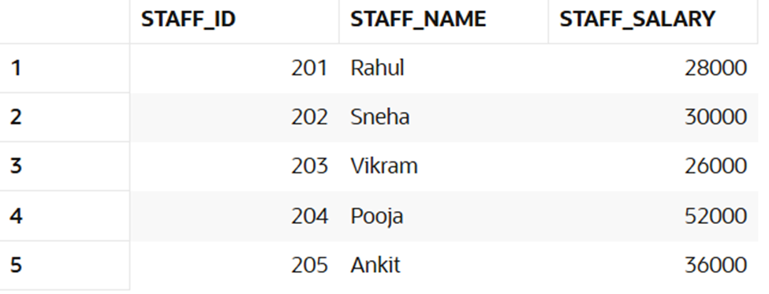
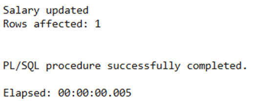
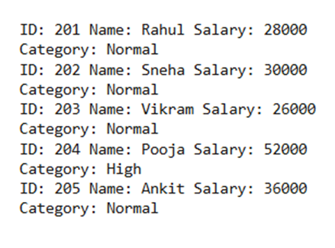

Experiment 6

Name: Pushpit kumar gaur	

UID: 24BAI70534

Branch: B.E. CSE (AIML)	

Section: 24AIT_KRG-G1

Semester: 4	

Date of Performance: 13.03.2026

Subject Name: Database Management System	

Subject Code: 24CSH-298

AIM: To understand the concept and working of cursors in PL/SQL for row-by-row data processing, and to analyze how implicit cursors, explicit cursors, and cursor attributes are used to implement business logic on multiple rows in a database table.

OBJECTIVES: 
•	To implement and analyze the use of implicit cursors, explicit cursors, and cursor attributes for processing multiple rows from a database table and applying business logic effectively.

SOFTWARE REQUIREMENTS: 
•	Database Management System:
    o	PostgreSQL Database
•	Database Administration Tool / Client Tool:
    o	pgAdmin 

PRACTICAL/EXPERIMENT STEPS: 
1.	An employees table was created in the Oracle database with columns such as emp_id, emp_name, and emp_sal to store employee details. 
2.	Sample employee records were inserted into the table to provide data for testing cursor operations. 
3.	The concept of implicit cursors was studied to understand how Oracle automatically handles DML operations like UPDATE. 
4.	A PL/SQL block using an implicit cursor was written to update employee salary and verify execution using SQL%FOUND and SQL%ROWCOUNT. 
5.	The concept of explicit cursors was explored to process multiple rows returned by a SELECT query. 
6.	A PL/SQL program using an explicit cursor was written to fetch employee records one by one and apply business logic. 
7.	The programs were executed in Oracle FreeSQL, and the output results were verified for correctness.

PROCEDURE: 
1.	The Oracle FreeSQL environment was opened to access the database. 
2.	A new employees table was created with fields such as emp_id, emp_name, and emp_sal.

3.	Sample employee records were inserted into the table using INSERT statements. 

4.	A PL/SQL block using an implicit cursor was written to update employee salary and check execution status using SQL%FOUND and SQL%ROWCOUNT. 
 

5.	An explicit cursor was declared to retrieve multiple employee records from the table. 
6.	The cursor was opened, and records were fetched one by one using a LOOP structure, and business logic was applied. 

7.	The cursor was closed after processing all records, and the output was observed and recorded.

CODE:
CREATE TABLE staff (
    staff_id NUMBER PRIMARY KEY,
    staff_name VARCHAR2(50),
    staff_salary NUMBER
);

INSERT INTO staff VALUES (201, 'Rahul', 28000);
INSERT INTO staff VALUES (202, 'Sneha', 47000);
INSERT INTO staff VALUES (203, 'Vikram', 26000);
INSERT INTO staff VALUES (204, 'Pooja', 52000);
INSERT INTO staff VALUES (205, 'Ankit', 36000);

COMMIT;

DECLARE
    v_staff_id staff.staff_id%TYPE := 202;
    v_updated_salary staff.staff_salary%TYPE := 30000;
BEGIN
    UPDATE staff
    SET staff_salary = v_updated_salary
    WHERE staff_id = v_staff_id;

    IF SQL%FOUND THEN
        DBMS_OUTPUT.PUT_LINE('Salary updated');
    ELSE
        DBMS_OUTPUT.PUT_LINE('Record not found');
    END IF;

    DBMS_OUTPUT.PUT_LINE('Rows affected: ' || SQL%ROWCOUNT);
END;
/

DECLARE
    CURSOR staff_cursor IS
        SELECT staff_id, staff_name, staff_salary FROM staff;

    s_id staff.staff_id%TYPE;
    s_name staff.staff_name%TYPE;
    s_salary staff.staff_salary%TYPE;
BEGIN
    OPEN staff_cursor;

    LOOP
        FETCH staff_cursor INTO s_id, s_name, s_salary;
        EXIT WHEN staff_cursor%NOTFOUND;

        DBMS_OUTPUT.PUT_LINE('ID: ' || s_id ||
                             ' Name: ' || s_name ||
                             ' Salary: ' || s_salary);

        IF s_salary > 42000 THEN
            DBMS_OUTPUT.PUT_LINE('Category: High');
        ELSE
            DBMS_OUTPUT.PUT_LINE('Category: Normal');
        END IF;

    END LOOP;

    CLOSE staff_cursor;
END;
/
    

I/O ANALYSIS: 
1.	Implicit Cursor Output
Displays messages indicating whether the employee salary was successfully updated and shows the number of rows affected using SQL%FOUND and SQL%ROWCOUNT.
 

2.	Explicit Cursor Output
Displays employee details (ID, Name, Salary) for each record fetched from the table.

3.	Business Logic Result
Shows classification of employees based on salary (e.g., “High Salary” or “Normal Salary”) for each row processed.

LEARNING OUTCOMES: 
1.	Understood the role of cursors in PL/SQL for handling multi-row query results.
2.	Differentiated between implicit cursors and explicit cursors.
3.	Used cursor attributes such as %FOUND, %NOTFOUND, %ROWCOUNT.
4.	Developed PL/SQL programs that process database records row by row.
5.	Applied cursor-based logic to real-world business scenarios.
 