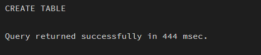
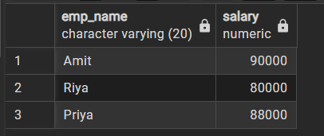
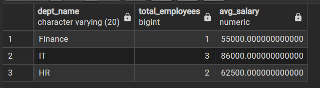
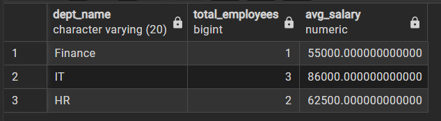
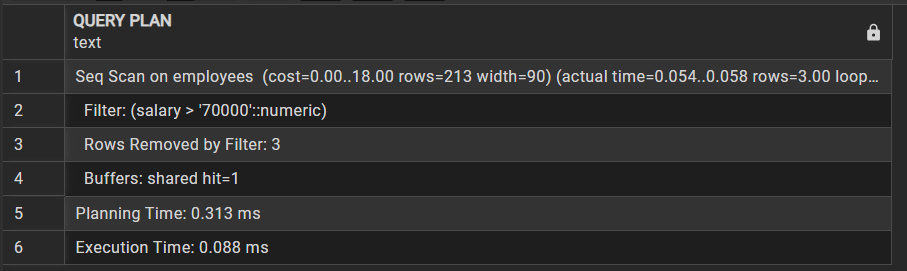
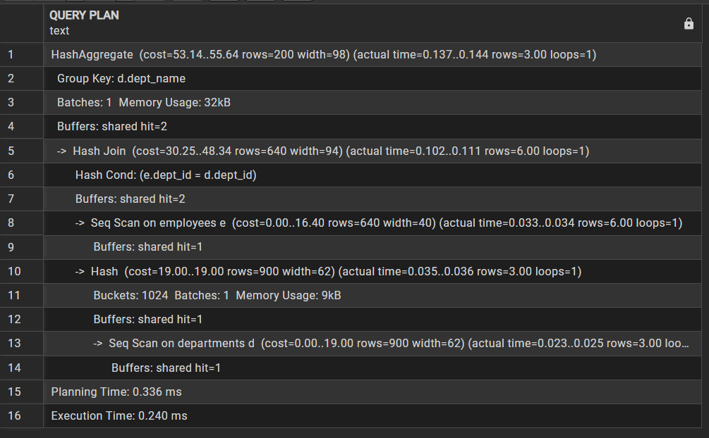
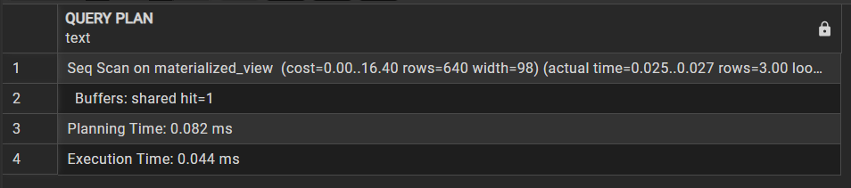

Experiment 7

Name: Pushpit kumar gaur

UID: 24BAI70534

Branch: B.E. CSE (AIML)	

Section: 24AIT_KRG-G1

Semester: 4	

Date of Performance: 13.03.2026

Subject Name: Database Management System	

Subject Code: 24CSH-298

AIM: To design and implement a materialized view and to compare and analyze execution time and performance differences between simple views, complex views, and materialized views, thereby understanding their impact on query optimization and system performance.

OBJECTIVES: 
•	To create simple views, complex views, and materialized views, and to evaluate their performance by comparing query execution time for each, highlighting the advantages of materialized views in enterprise-level applications.

SOFTWARE REQUIREMENTS: 
•	Database Management System:
        o	PostgreSQL Database
•	Database Administration Tool / Client Tool:
        o	pgAdmin 

PRACTICAL/EXPERIMENT STEPS: 
1.	Departments and employees tables were created in the database to store department details and employee information. 
2.	Sample records were inserted into both tables to provide data for testing views. 
3.	A simple view was created on the employees table using a salary filter to display high-paid employees. 
4.	A complex view was created using JOIN and aggregation functions to calculate department-wise employee count and average salary. 
5.	A materialized view was created to store the precomputed results of the complex query. 
6.	SELECT queries were executed on all three views to observe the output. 
7.	EXPLAIN ANALYZE was used to compare the execution time and performance of simple, complex, and materialized views.

PROCEDURE: 
1.	The pgAdmin (PostgreSQL) environment was opened to access the database. 
2.	Departments and employees tables were created with appropriate fields and relationships using PRIMARY KEY and FOREIGN KEY constraints. 
 

3.	Sample data was inserted into both tables using INSERT statements. 
 

4.	A simple view was created to display employee names and salaries above a specified threshold. 
 

5.	A complex view was created using JOIN and GROUP BY to calculate department-wise statistics. 
 

6.	A materialized view was created to store the results of the complex query for faster access. 
 

7.	Queries and EXPLAIN ANALYZE statements were executed to observe results and compare performance. 

CODE:
CREATE TABLE departments(
    dept_id INT PRIMARY KEY,
    dept_name VARCHAR(20)
)

CREATE TABLE employees(
    emp_id INT PRIMARY KEY,
    emp_name VARCHAR(20),
    dept_id INT REFERENCES departments(dept_id),
    salary NUMERIC
)

INSERT INTO departments VALUES
(1, 'IT'),
(2, 'HR'),
(3, 'Finance')

INSERT INTO employees VALUES
(101, 'Amit', 1, 90000),
(102, 'Riya', 1, 80000),
(103, 'Karan', 2, 60000),
(104, 'Neha', 2, 65000),
(105, 'Arjun', 3, 55000),
(106, 'Priya', 1, 88000)

-- simple View
CREATE VIEW simple_view AS
SELECT emp_name, salary
FROM employees
WHERE salary > 70000

SELECT * FROM simple_view

-- complex view
CREATE VIEW complex_view AS
SELECT d.dept_name,
       COUNT(e.emp_id) AS total_employees,
       AVG(e.salary) AS avg_salary
FROM employees e
JOIN departments d
ON e.dept_id = d.dept_id
GROUP BY d.dept_name

SELECT * FROM complex_view

-- materialised view
CREATE MATERIALIZED VIEW materialized_view AS
SELECT d.dept_name,
       COUNT(e.emp_id) AS total_employees,
       AVG(e.salary) AS avg_salary
FROM employees e
JOIN departments d
ON e.dept_id = d.dept_id
GROUP BY d.dept_name

SELECT * FROM materialized_view

REFRESH MATERIALIZED VIEW materialized_view

EXPLAIN ANALYZE SELECT * FROM simple_view
EXPLAIN ANALYZE SELECT * FROM complex_view
EXPLAIN ANALYZE SELECT * FROM materialized_view

I/O ANALYSIS: 
1.	Simple View Output
Displays employee names and salaries where salary is greater than 70000.
 

2.	Complex View Output
Displays department-wise data including total employees and average salary.
 

3.	Materialized View Output
Displays the same aggregated results as the complex view but retrieved faster.
 

4.	Performance output
EXPLAIN ANALYZE shows execution time, where the materialized view executes faster than the complex view.
 

 

 

 
 
LEARNING OUTCOMES: 
1.	Understood the concept and working of materialized views in a database system.
2.	Differentiated between simple views, complex views, and materialized views.
3.	Created materialized views in PostgreSQL.
4.	Compared query execution time for different types of views.
5.	Analyzed performance benefits of materialized views in data-intensive applications.
6.	Applied materialized view concepts in real-world company scenarios.