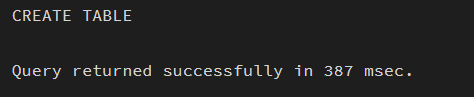
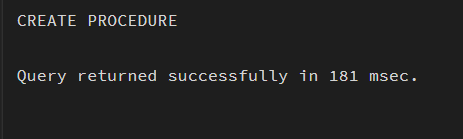
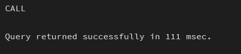
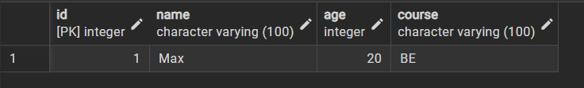
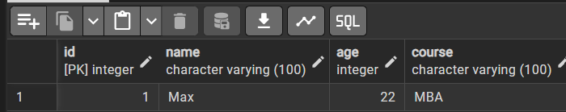
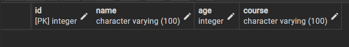

Experiment 9
Name: Pushpit kumar gaur	
UID: 24BAI70534
Branch: B.E. CSE (AIML)
Section: 24AIT_KRG-G1
Semester: 4	
Date of Performance: 01.04.2026
Subject Name: Database Management System	
Subject Code: 24CSH-298

AIM: To design and implement stored procedures in PostgreSQL for performing Create, Read, Update, and Delete (CRUD) operations on database tables in an efficient and reusable manner.

OBJECTIVES: 
•	To understand the concept and importance of stored procedures. 
•	To implement parameterized stored procedures. 
•	To perform INSERT, UPDATE, DELETE, and SEARCH operations. 
•	To improve database performance and security. 
•	To gain industry-relevant procedural SQL experience. 

SOFTWARE REQUIREMENTS: 
•	Database Management System:
o	PostgreSQL Database
•	Database Administration Tool / Client Tool:
o	pgAdmin 

PRACTICAL/EXPERIMENT STEPS: 
1.	A students table was created to store student details like ID, name, age, and course. 
2.	A stored procedure add_student was implemented to insert new records. 
3.	A function get_students was created to retrieve all records from the table. 
4.	A stored procedure update_student was designed to update existing student data. 
5.	A stored procedure delete_student was implemented to remove records using ID. 
6.	A function search_student was created to search students by name. 
7.	All CRUD operations were tested using procedure calls and SELECT statements. 

PROCEDURE: 
1.	PostgreSQL (pgAdmin) was opened and the required database was selected. 
2.	The students table was created using CREATE TABLE with appropriate fields. 
3.	Stored procedures were written using CREATE OR REPLACE PROCEDURE for INSERT, UPDATE, and DELETE operations. 
4.	Functions were created using CREATE OR REPLACE FUNCTION for SELECT and SEARCH operations. 
5.	Parameters were passed to procedures to perform dynamic operations. 
6.	Procedures were executed using CALL and functions using SELECT. 
7.	The output was verified to ensure correct implementation of CRUD operations. 

CODE:
-- Create table
CREATE TABLE learners (
    learner_id SERIAL PRIMARY KEY,
    full_name VARCHAR(120),
    learner_age INT,
    program VARCHAR(120)
);

-- Insert Procedure
CREATE OR REPLACE PROCEDURE insert_learner(
    l_name VARCHAR,
    l_age INT,
    l_program VARCHAR
)
LANGUAGE plpgsql
AS $$
BEGIN
    INSERT INTO learners(full_name, learner_age, program)
    VALUES (l_name, l_age, l_program);
END;
$$;

-- Call insert
CALL insert_learner('Alex', 21, 'BTech');
SELECT * FROM learners;

-- Fetch Function
CREATE OR REPLACE FUNCTION fetch_learners()
RETURNS TABLE(
    learner_id INT,
    full_name VARCHAR,
    learner_age INT,
    program VARCHAR
)
LANGUAGE plpgsql
AS $$
BEGIN
    RETURN QUERY SELECT * FROM learners;
END;
$$;

-- Call fetch
SELECT * FROM fetch_learners();

-- Update Procedure
CREATE OR REPLACE PROCEDURE modify_learner(
    l_id INT,
    l_name VARCHAR,
    l_age INT,
    l_program VARCHAR
)
LANGUAGE plpgsql
AS $$
BEGIN
    UPDATE learners
    SET full_name = l_name,
        learner_age = l_age,
        program = l_program
    WHERE learner_id = l_id;
END;
$$;

-- Call update
CALL modify_learner(1, 'Alex', 23, 'MBA');
SELECT * FROM learners;

-- Delete Procedure
CREATE OR REPLACE PROCEDURE remove_learner(
    l_id INT
)
LANGUAGE plpgsql
AS $$
BEGIN
    DELETE FROM learners
    WHERE learner_id = l_id;
END;
$$;

-- Call delete
CALL remove_learner(1);
SELECT * FROM learners;

-- Search Function
CREATE OR REPLACE FUNCTION find_learner(l_id INT)
RETURNS TABLE(
    learner_id INT,
    full_name VARCHAR,
    learner_age INT,
    program VARCHAR
)
LANGUAGE plpgsql
AS $$
BEGIN
    RETURN QUERY
    SELECT l.learner_id, l.full_name, l.learner_age, l.program
    FROM learners l
    WHERE l.learner_id = l_id;
END;
$$;

-- Call search
SELECT * FROM find_learner(1);I/O ANALYSIS: 
1.	Create a table 
The students table is successfully created with fields such as id, name, age, and course. The id is defined as a primary key with auto-increment, ensuring unique student records.

 

 
2.	Creating a Procedure (INSERT)
The stored procedure add_student is created successfully. It accepts parameters (name, age, course) and inserts a new record into the table. A new record is inserted into the students table successfully. 
 
 

 
3.	Creating a Function (READ)
The function get_students is created to fetch all records from the table. Displays all student records present in the table.
 

 
4.	UPDATE Operation
The stored procedure update_student is created to update existing student details using ID. The record with id = 1 is successfully updated with new values.
 

 
5.	DELETE Operation
The stored procedure delete_student is created to delete a student record based on ID. The record with id = 1 is removed from the table.
 

 
6.	SEARCH Operation
The function search_student is created to search records using id. It displays records with the given id.
  

LEARNING OUTCOMES: 
1.	Gained understanding of stored procedures and functions in PostgreSQL for efficient database operations. 
2.	Learned to implement CRUD operations (Create, Read, Update, Delete) using parameterized procedures and functions. 
3.	Developed the ability to improve data handling, reusability, and security in database applications using PL/pgSQL.
